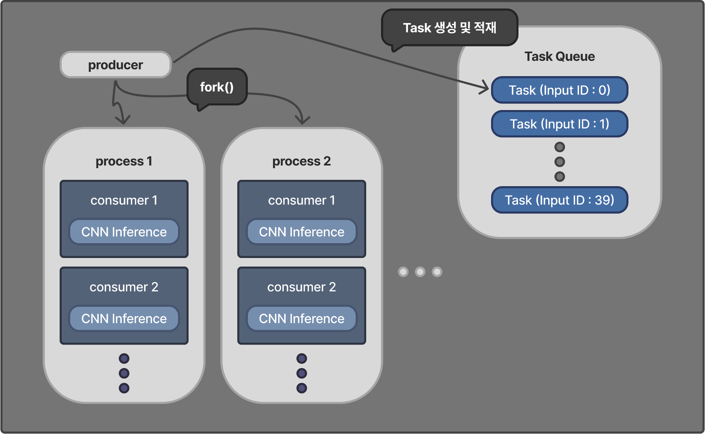

# OS Project: CNN Inferece 연산 병렬 처리 성능 비교 분석

본 프로젝트는 **운영체제 수업**의 팀 프로젝트로 CNN(Convolutional Neural Network) Inference 연산을 병렬화하여 다양한 구조에서의 성능을 비교하고 분석하는 것을 목표로 합니다.
구체적으로는 **프로세스** 기반, **스레드** 기반, 그리고 **프로세스와 스레드를 복합적으로 고려**한 최적화된 구조를 구현하고 각 구조의 자원 활용 효율과 확장성, 동기화 방식에 따른 차이를 정량적으로 분석합니다.

---

## ✅ 프로젝트 개요

- CNN Inference 연산을 모델링한 C 기반 프로그램 구현
- 입력값 생성, 연산 처리, 출력까지 전체 파이프라인 병렬화
- producer-consumer 구조 기반의 멀티 프로세스 + 멀티 스레드 구조 최적화
- 동기화 방식 미적용에 따른 race condition 문제와 해결을 위한 synchronization 기법

---

## 🔧 시스템 구조 개요

- producer 프로세스가 입력 데이터를 생성하고 Task Queue에 적재
- 여러 consumer 프로세스가 fork로 생성되며 각 프로세스는 여러 스레드로 구성
- 각 스레드는 Task Queue로부터 하나씩 Task를 가져와 연산 처리
- CNN Inference 연산은 Convolution → ReLU → MaxPooling → FullyConnected1 → FullyConnected2 순으로 진행



---

## 🧪 실험 구성

### 구현 구조

- 'baseline' : 기본 구조
- 'st' : Single Thread 구조
- 'sp' : Single Process 구조
- 'mt' : Multi Thread 구조
- 'mp' : Multi Process 구조
- 'mpmt_*' : Multi Process + Multi Thread 구조
      - 'mpmt_mutex' : mutex lock 사용 synchronization
      - 'mpmt_noSync' : synchronization 적용 X

---

## 📊 측정 항목 

| 항목 | 설명 |
|------|------|
| Wall Time | 전체 수행 시간 (ms) |
| CPU Utilization | user + sys 시간 기준 비율 (%) |
| Memory Usage | RSS, VmSize |
| 코어별 사용률 및 부하 분산 분석 | `mpstat` 사용 |

---

## 📁 폴더 구조 

```
OSproject/
├── README.md
├── Makefile
├── OSproject_system_architecture.png
├── .gitignore
│
├── /src                    # 주요 소스코드 디렉토리
│   ├── baseline.c
│   ├── st.c                # Single Thread
│   ├── sp.c                # Single Process
│   ├── mt.c                # Multi Thread
│   ├── mp.c                # Multi Process
│   ├── mpmt_mutex.c        # MP + MT + mutex
│   ├── mpmt_noSync.c       # MP + MT, No Sync
│
├── /bin                    # 컴파일된 실행파일 
│   ├── baseline
│   ├── st
│   ├── sp
│   ├── mt
│   ├── mp
│   ├── mpmt_mutex
│   └── mpmt_noSync
│
├── /log                   # 측정 결과 temp 데이터
│   ├── cpu_stat.log
│   └── gmon.out
│
├── /project0              # 이전 버전 백업
├── /project1
├── /project2
└── /project_final         # 최종 버전 백업

```

---

## 📈 결과 정리

- 최적 구조는 CPU utilization 최대화 및 idle 상태 최소화 달성
- 병렬 처리 구조에서는 synchronization 유무에 따른 다양한 race condition 발생 가능

---

## 🧩 Future Work

- 프로세스-스레드 간 연산 역할 재분배하여 load imbalance 문제 해결
- 병렬 처리 성능 최대화를 위해 Work Stealing 구조 구현
- 동기화 방식 비교 확대 (lock-free queue, atomic operation 등)
- 코어 수 변화에 따른 동적 병렬 처리 구조 설계
- 실제 workload와 유사한 heterogeneous task scenario에서 테스트

---

